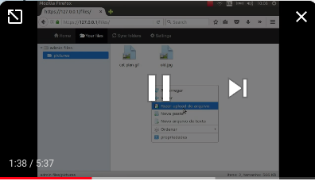

# Old Man Yells at Cloud

Minimalistic easy to use remote file manager in a docker container.


Because you know, there is no cloud, just other people computer :) 

My goal is selfhost a file manager for a small group (5 to 10 users). In my specific case, I am running a family backup service with a synology NAS in the background and OMYC at front because cloud setup (with large storage) can get too expensive.

Features:

* Keep it simple and stupid (if you need more, go nextcloud)
* Web access (can manage, preview, upload and download)
* Sftp access (fast. secure. mount as local drive. native linux client. 3rd party apps for others)
* Sync service (resilio sync is solid!. linux/osx/windows/android/ios)
* Multi user (your mom files are your mom files. your files are your files)
* Easy to deploy (a single docker container to start)
* No vendor lock (Folder friendly. All data stored in plain files/folders at host.)

A nice video:

[](http://www.youtube.com/watch?v=eXnrw_33HeQ "OMYC example")

I did not build all services from scratch. I just patchwork multiple projects, build a web front end and pack all as a single docker image to easy deploy. This is what I use:

* Elfinder web file manager. http://elfinder.org/
* Proftpd sftp server. http://www.proftpd.org/
* Resilio sync engine. https://www.resilio.com/individuals/
* Web stack with apache, perl, Mojolicious, php, angular js and bootstrap
* Ubuntu as main os.
* Docker to simplify deployment

> ### I express infinite gratitude to all above projects. 
> ### "I am what I am because of who we all are." :)


# Test yourself

Need NO git pull or build. You can use official docker image. 

* Make sure you have all exposed ports free (22, 80, 443, 55555)
* Define host folder to store data
* Start omyc in a single line 

```
docker run -d \
	-v /tmp/omyc-data:/data \
	-p 22:22 \
	-p 80:80 \
	-p 443:443 \
	-p 55555:55555 \
	omyc/omyc
```
* Access https://127.0.0.1 (or host ip)
* First user is **admin** password **admin**. **CHANGE ASAP!**
* Sftp to 127.0.0.1 (or host ip)
* Check resilio sync

# Disclaimer

* Remember this is a personal project. I am just a man with a problem that decide to share the solution. 
* "Never Trust, Always Verify". Check the code before use. 
* Branch if need your own modifications. Check [dev docs](docs/dev.md)
* have fun :)
